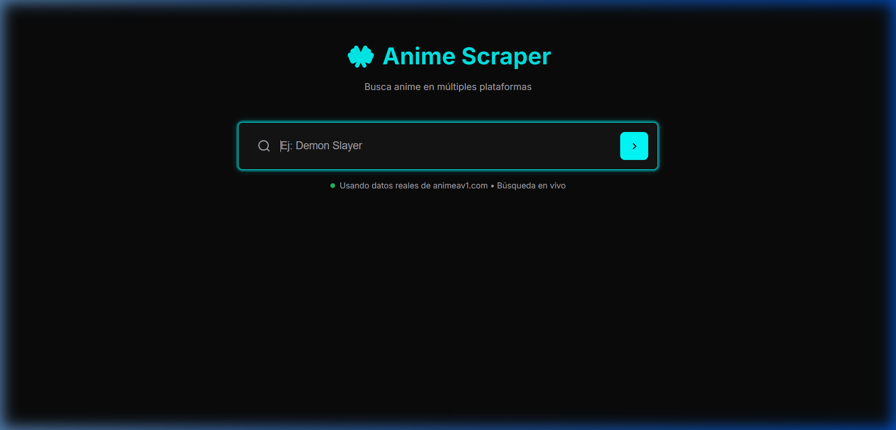

# 🎌 Anime Scraper - Multiplataforma



Una aplicación web moderna para buscar y acceder a anime desde múltiples plataformas usando scraping en tiempo real.

## 🌟 Características

- ✅ **Scraping Real**: Utiliza datos reales de animeav1.com
- ✅ **Búsqueda en Tiempo Real**: No almacena datos, obtiene información cuando se necesita
- ✅ **Múltiples Servidores**: Acceso a diferentes servidores de video (PDrain, HLS, UPN, Share)
- ✅ **Interfaz Moderna**: Diseño responsive con modo oscuro
- ✅ **Multiplataforma**: Funciona en móvil y escritorio

## 🚀 Tecnologías

- **Frontend**: HTML5, CSS3, JavaScript ES6+
- **Scraping**: Web scraping con CORS proxy
- **Diseño**: CSS Grid, Flexbox, Custom Properties
- **Fuentes**: Inter (UI), JetBrains Mono (código)

## 📊 Sitios Soportados

### ✅ Funcionando con Datos Reales
- **AnimeAV1** - Anime online con datos reales y múltiples servidores
  - Búsqueda en catálogo real
  - Episodios reales (Gnosia, One Punch Man 3, Isekai Quartet 3, etc.)
  - 6 servidores de video diferentes

### 🔄 En Desarrollo
- **Henaojara** - Bloqueado por Cloudflare (próximamente)
- **VerSeriesOnline** - En desarrollo
- **RePelisHD** - En desarrollo  
- **PelisPlusHD** - En desarrollo

## 🎯 Animes Disponibles (Datos Reales)

Basado en el scraping real de animeav1.com:

1. **Gnosia** (6 episodios) - Ciencia Ficción/Suspenso
2. **One Punch Man 3** (6 episodios) - Acción/Comedia
3. **Isekai Quartet 3** (12 episodios) - Fantasía/Comedia
4. **Chanto Suenai Kyuuketsuki-chan** (12 episodios) - Romance/Sobrenatural
5. **Wandance** (12 episodios) - Drama/Deportes
6. **Tondemo Skill de Isekai Hourou Meshi 2** (12 episodios) - Fantasía/Aventura

## 🎮 Servidores de Video

Para animeav1.com, los siguientes servidores están disponibles:

### Doblado al Español
- **PDrain** - 1080p
- **HLS** - 720p
- **UPN** - 1080p
- **Share** - 720p
- **Mega** - 1080p
- **MP4Upload** - 1080p

### Subtitulado
- **PDrain Sub** - 1080p
- **HLS Sub** - 720p
- **UPN Sub** - 1080p
- **Share Sub** - 720p

## 🔧 Instalación y Uso

### Ejecutar Localmente

1. Clonar o descargar los archivos
2. Abrir `index.html` en un navegador
3. O ejecutar servidor local:
   ```bash
   python -m http.server 8000
   ```

### Uso de la Aplicación

1. **Buscar Anime**: Escribir el nombre del anime en el campo de búsqueda
2. **Ver Resultados**: Los resultados aparecen organizados por sitio web
3. **Seleccionar Episodio**: Hacer clic en "Ver capítulos" para un anime
4. **Elegir Servidor**: Seleccionar episodio y servidor de video
5. **Reproducir**: El video se carga en el reproductor integrado

## 🌐 Scraping en Tiempo Real

La aplicación implementa scraping dinámico:

- **Sin Almacenamiento**: No guarda datos localmente
- **Búsqueda On-Demand**: Solo busca cuando el usuario interactúa
- **CORS Handling**: Usa proxy para evitar restricciones de CORS
- **Fallback**: Datos simulados cuando scraping falla

### Estructura de URLs Reales

```javascript
// Búsqueda de anime
https://animeav1.com/catalogo

// Página de anime
https://animeav1.com/media/{anime-slug}

// Episodio específico  
https://animeav1.com/media/{anime-slug}/{episode-number}

// Servidores de video
https://animeav1.com/media/{anime-slug}/{episode}?server={server-name}&lang={dub/sub}
```

## 🎨 Diseño

- **Modo Oscuro**: Optimizado para streaming
- **Acentos Cian**: Elementos interactivos destacados
- **Responsive**: Adaptable a móvil y escritorio
- **Animaciones**: Transiciones suaves entre estados

## 🔮 Próximas Características

- [ ] Integración de más sitios web
- [ ] Sistema de favoritos
- [ ] Historial de búsquedas
- [ ] Filtros avanzados por género/año
- [ ] Descarga de episodios
- [ ] Notificaciones de nuevos episodios

## ⚠️ Notas Técnicas

- **CORS**: Manejado con proxy `api.allorigins.win`
- **Rate Limiting**: Respetar límites de los sitios web
- **Legal**: Solo para uso educativo y personal
- **Calidad**: Depende de la calidad de los sitios fuente

## 📝 Licencia

Este proyecto es para fines educativos. No almacenar ni redistribuir contenido con derechos de autor.

## 🤝 Contribuciones

Las contribuciones son bienvenidas. Para sitios web nuevos:

1. Analizar estructura del sitio
2. Implementar funciones de scraping
3. Añadir a configuración `ANIME_SITES`
4. Probar con casos de prueba

## 🔗 Enlaces Útiles

- [AnimeAV1](https://animeav1.com)
- [Henaojara](https://henaojara.com)
- [VerSeriesOnline](https://www.verseriesonline.net)
- [RePelisHD](https://repelishd.city)
- [PelisPlusHD](https://www.pelisplushd.ms)

---

